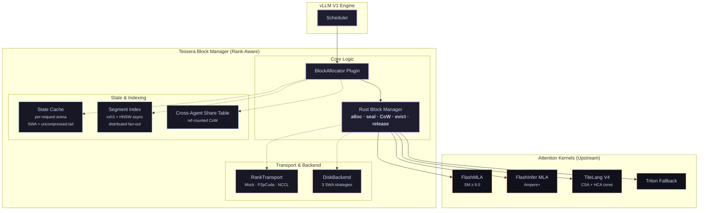

# Tessera

> **MLA-aware, V4-aligned KV block manager for multi-agent inference.** PagedAttention
> was designed for MHA. DeepSeek's MLA compresses the V3 KV cache **56.9×**; DeepSeek-V4
> (May 2026 paper preview) extends this with hybrid CSA + HCA + SWA attention and states
> the design constraint Tessera was built for:
>
> > *"The hybrid attention mechanism violates fundamental assumptions behind PagedAttention
> > and its variants."* — DeepSeek-V4 paper §3.5.1
>
> Tessera implements the **block-layout and accounting layer** for MLA and the V4 hybrid:
> per-layer schemes, mixed-precision regions (BF16 + FP8 + FP4), a two-tier paged KV +
> per-request State Cache, and a filesystem-backed `DiskBackend` for V4 cache
> persistence. Attention kernels stay upstream (FlashMLA / FlashInfer / Triton /
> TileLang); Tessera mounts on them via the kernel dispatch layer.

[](https://github.com/angelnicolasc/tessera/actions/workflows/ci.yml)
[](https://github.com/angelnicolasc/tessera/actions/workflows/bench.yml)
[](https://codecov.io/gh/angelnicolasc/Tessera)
[](#license)
[](rust-toolchain.toml)
[](pyproject.toml)
[](https://angelnicolasc.github.io/Tessera)
[](CHANGELOG.md)
[](CHANGELOG.md)
[](https://github.com/angelnicolasc/tessera/actions/workflows/wheel.yml)

---

## What it does



## The numbers

### DeepSeek-V3 (MLA) — `L=61`, `H=128`, `d_h=128`, `d_c=512`, `d_r=64`

|  Context | MHA BF16 | MLA BF16 | MLA FP8 | Ratio |
| -------: | -------: | -------: | ------: | ----: |
|       8K |  30.5 GB |  0.54 GB | 0.30 GB | 56.6× |
|      32K | 122.0 GB |  2.17 GB | 1.21 GB | 56.2× |
|     128K | 488.0 GB |  8.68 GB | 4.84 GB | 56.2× |
|     512K | 1.95 TB  | 34.72 GB | 19.4 GB | 56.2× |
|       1M | 3.90 TB  | 69.44 GB | 38.7 GB | 56.2× |

### DeepSeek-V4 (hybrid) — paper §2.3.4: ~**2% of GQA8 BF16** at 1M context

Per-token-per-layer storage cost under V4-Pro (`k1=4`, `k2=128`, `d_h=512`, `d_r=64`, indexer=128 dims):

| Scheme | Compression | Per-token bytes/layer | Composition |
|---|---|---|---|
| CSA  | `k1 = 4` (overlapping) | **160 B** | `(64·BF16 + 448·FP8 + 128·FP4)/4` |
| HCA  | `k2 = 128` | **4 B** | `(64·BF16 + 448·FP8)/128` |
| SWA  | uncompressed (cap `win=128`) | 576 B | `64·BF16 + 448·FP8` |

Tessera's accounting matches these constants — pinned by
`tests/test_v4_config.py::test_native_v4_csa_bytes_per_token_matches_paper` and the
sibling Rust unit tests.

## What's new vs upstream

| Inefficiency in 2026 stacks | Tessera fix |
| --- | --- |
| Frameworks expand `W_UK · c_kv` before caching, discarding compression | Stores `c_kv` + `k_rope` natively; never materialises full K/V |
| Block size tuned for MHA (16 tokens) — wrong by 100× for MLA, 200× for V4 | 64-token blocks for MLA (FlashMLA-native); `lcm(k1, k2)=128` for V4 hybrid |
| Prefix caching needs exact token-prefix match, ignores `c_kv` position-independence | Content-addressed `c_kv` hashing; cross-agent sharing without estimation |
| Multi-agent pipelines recompute shared context | Ref-counted CoW share table; zero-copy reuse |
| PagedAttention can't model V4's per-layer heterogeneity | Per-layer `CompressionScheme` map; CSA/HCA/SWA as sibling variants |
| No on-disk V4 KV persistence abstraction | `DiskBackend` implements a filesystem-backed `DeviceBackend` with three SWA persistence strategies; eviction spillover integration is Sprint 6+ |
| Multi-GPU coordination reinvented per project | `RankTransport` trait (Mock + P2pCuda stub + NCCL stub) + distributed segment index |
| Long-context FP8 regression (vLLM April 2026) | Per-layer FP8 calibration + BF16-always RoPE + V4 mixed precision (BF16 + FP8 + FP4) |

## Quick start

```bash
# Build the Rust workspace (5 feature flags: default, cuda, nccl, otel-rust, testing)
cargo build --workspace --all-targets

# Build and install the Python extension into the active venv
maturin develop -m crates/tessera-py/Cargo.toml

# Run Rust + Python tests (no GPU needed — CPU mock backend is default)
just test

# Memory reports
python -m benchmarks.memory_report                      # MHA vs MLA vs MLA FP8
python -m benchmarks.sharing_bench                      # cross-agent dedup (N=16 agents)

# Serve the docs locally
just docs-serve
```

```python
from tessera.config import TesseraConfig
from tessera import BlockManager  # native, lazy-imported

# DeepSeek-V3 MLA (Sprints 0–4 codepath)
v3 = TesseraConfig.from_toml("models/deepseek_v3.toml")
print(f"V3 compression vs MHA BF16: {v3.compression_ratio_vs_mha_bf16():.1f}x")

# DeepSeek-V4 hybrid (Sprint 5 codepath — per-layer schemes)
v4 = TesseraConfig.from_toml("models/deepseek_v4_pro.toml")
print(f"V4-Pro is hybrid: {v4.is_v4}, layers: {v4.model.num_layers}")
native = v4.to_native_config()
print(f"V4 block-size LCM: {native.v4_block_size_lcm()}")  # 128
```

## Architecture at a glance

* `crates/tessera-core` — Rust block manager. Generic over `DeviceBackend` (CPU mock /
  CUDA / Disk). Allocation, seal+dedup, copy-on-write, eviction (tiered LRU), per-request
  lifecycle, reserve-then-stream PD-disaggregation, latency injection, OTLP bridge, V4
  hybrid attention support.
* `crates/tessera-index` — `IndexBackend` trait + `usearch` HNSW + `DistributedSegmentIndex`
  with topology-aware budget scaling.
* `crates/tessera-py` — PyO3 module `tessera._native`.
* `python/tessera` — Config (pydantic v2), `SegmentIndex` (two-layer async), kernel
  dispatch, vLLM V1 `BlockAllocator` plugin (rank-aware), FP8 calibration harness,
  multi-rank coordinator.

**Sprint 5 additions**: `state_cache::StateCache` (per-request arena for V4 SWA + tail),
`device::DiskBackend` (filesystem-backed `DeviceBackend` impl with three SWA caching
strategies), `CompressionScheme::{V4Csa, V4Hca, V4Swa}` sibling variants,
`CkvDtype::{Fp4E2m1, MixedBf16Fp8Fp4}`, per-layer scheme maps in `MlaBlockConfig`.

Read **`docs/src`** for the long-form treatment, including **24 ADRs** documenting every
load-bearing design choice, `docs/src/v4_compliance.md` for the V4 alignment summary, and
component pages for the [State Cache](docs/src/state_cache.md) and
[Disk Backend](docs/src/disk_backend.md).

## Sprint 5 status — DeepSeek-V4 alignment, CPU-validated

Sprint 4 hardened the distributed protocols. Sprint 5 aligns Tessera's block layout +
accounting layer with the DeepSeek-V4 paper preview (May 2026). Everything marked ✅
runs on CPU-only machines; ⏳ items are wired but pending GPU validation.

| Deliverable | Status |
|---|---|
| `CompressionScheme::{V4Csa, V4Hca, V4Swa}` variants (paper §2.3) | ✅ CPU |
| `CkvDtype::{Fp4E2m1, MixedBf16Fp8Fp4}` mixed-precision dtypes (§2.3.4) | ✅ CPU |
| Per-layer schemes in `MlaBlockConfig` (V4 hybrid interleaving) | ✅ CPU |
| `StateCache` per-request arena for SWA + tail (§3.5.1, ADR-0023) | ✅ CPU |
| `DiskBackend` with 3 SWA caching strategies (§3.5.2, ADR-0024) | ✅ CPU |
| V4 model configs: `deepseek_v4_flash.toml` + `deepseek_v4_pro.toml` (§4.2.1 dims) | ✅ CPU |
| Per-token byte accounting verified against paper (CSA 160 B, HCA 4 B, SWA 576 B) | ✅ CPU |
| `DsaHierarchical` deprecated with V4 migration message | ✅ CPU |
| 24 ADRs (0001–0024) | ✅ |
| `docs/src/v4_compliance.md` gap summary + research analysis | ✅ |
| 25+ new Sprint 5 tests (Rust unit + Python pydantic + DiskBackend tempdir) | ✅ CPU |
| FlashMLA / FlashInfer parity vs PyTorch reference oracle | ⏳ GPU-gated |
| 128K needle-in-haystack precision regression (Sprint 1 harness wired) | ⏳ GPU-gated |
| Tessera vs vLLM throughput benchmark | ⏳ GPU-gated |
| vLLM-engine integration test (real engine + V4 layout) | ⏳ GPU-gated |
| V4 kernel runtime (TileLang Lightning Indexer + CSA/HCA cores) | ⏳ Upstream-pending |

What's deferred (Sprint 6+ / cloud-burst):

- **V4 kernel runtime** — DeepSeek's TileLang reference impl on Hugging Face; Tessera
  integrates via `kernel_dispatch.py` once a cloud-burst session validates the wrapper.
- **`CudaXxh3Hasher`** — on-device hashing kernel; `hash_device` seam ready since Sprint 1.
- **FlashAttention-4 backend** — `KernelBackend::FlashAttn4` is an explicit experimental
  stub; integrates when upstream stabilises.
- **`P2pCudaTransport` runtime** — NVLink P2P API wired; runtime body cloud-burst gated.
- **`NcclTransport` runtime** — multi-node IB stub compiles under `--features nccl`;
  runtime body Sprint 6+.
- **`DiskBackend` mmap + eviction integration** — currently mirrored `Vec<u8>` buffers;
  `memmap2` zero-copy and block-manager spillover scheduled for Sprint 6 (TD-035, TD-036).
- **FP4 calibration tooling** — generalises from `fp8_calibrate.py` with one constant swap
  (TD-034).
- **ARM64 manylinux wheels + PyPI publish** — governance + CI matrix extension; ARM64
  was previously scheduled for Sprint 3, now consolidated into Sprint 6 v1.0 release
  preparation.
- **GrayMatter integration** — designed at the prefill boundary; pending the sibling Go
  project's hardening cycle before wiring.

## Relation to other systems

| System | Layer | Tessera relation |
| --- | --- | --- |
| **DeepSeek-V3** (MLA) | Model | Layout supported: `CompressionScheme::MlaLatent`. 56.9× compression vs MHA BF16 (structurally verified) |
| **DeepSeek-V4** (CSA/HCA/SWA hybrid) | Model | Layout supported: per-layer `V4Csa`/`V4Hca`/`V4Swa`. ~2% vs GQA8 BF16 at 1M per the paper §2.3.4; structural accounting paper-aligned (kernel runtime upstream-pending) |
| **Kimi-K2** (MLA) | Model | Layout supported via `MlaLatent` |
| **FlashMLA** | Kernel | Tessera **mounts on** it; we don't ship a kernel |
| **FlashInfer MLA** | Kernel | Fallback backend (Ampere+) |
| **TileLang** (V4 ref impl) | Kernel | Future mount point for V4 hybrid cores; dispatcher ready |
| **vLLM** | Serving framework | V1 `BlockAllocator` plugin; rank-aware (Sprint 3+) |
| **RadixAttention / APC** | Block-layer sharing | Requires exact token-prefix; we share `c_kv` content |
| **KVCOMM** | Cross-agent KV | Works on any model; we exploit MLA's native position-independence (zero estimation error) |
| **TokenDance** | Scheduler | Could use Tessera as its block layer |
| **GrayMatter** (sibling project) | Token-layer compression | Designed integration pending; will compose at the prefill boundary |

## License

Dual-licensed under [MIT](LICENSE-MIT) **or** [Apache-2.0](LICENSE-APACHE) at your option.

## Contributing

See [CONTRIBUTING.md](CONTRIBUTING.md). All contributions are dual-licensed by submission.
For security disclosures: [SECURITY.md](SECURITY.md).
